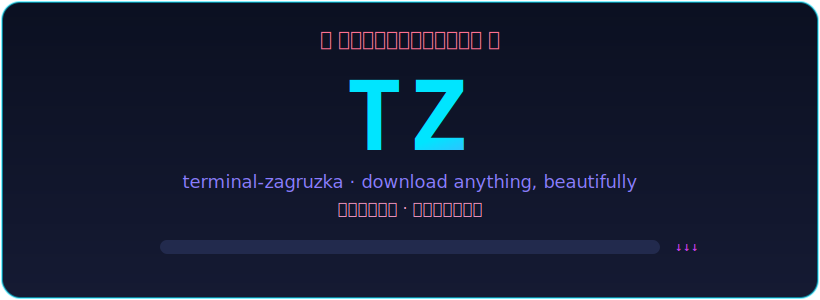

# terminal-zagruzka · `tz`

<p align="center">
  
</p>

> **🌸 ダウンロード · Download anything, beautifully — right from your terminal. 🌸**

`terminal-zagruzka` (Russian *загрузка* — "download/loading") is a friendly,
animated terminal front-end for [**yt-dlp**](https://github.com/yt-dlp/yt-dlp).
**No flags to memorize:** just run `tz`, paste a video or playlist link, and the
program shows you a little menu of formats to pick from — then plays a Japanese
sakura (cherry-blossom) pixel animation while it works. It runs on **Linux** and
**macOS** and exposes the power of `yt-dlp` through a UI simple enough for anyone.

```
   ⛩  ﾀｰﾐﾅﾙ・ｻﾞｸﾞﾙｽﾞｶ  ⛩

   ████████╗ ███████╗
   ╚══██╔══╝ ╚══███╔╝
      ██║      ███╔╝
      ██║     ███╔╝
      ██║    ███████╗
      ╚═╝    ╚══════╝
   terminal-zagruzka · download anything, beautifully
   ダウンロード · 何でも、美しく
```

## ✨ Features

- **No flags required** — run `tz`, paste a link, and **choose your format from a
  menu** by typing a single number. The menu even shows which qualities the video
  actually offers (e.g. `✓ available` / `↓ best is 720p`).
- **Beautiful, animated experience** — a Japanese-styled pixel banner, a **sakura
  cherry-blossom loading animation** while it reads the link, a live "packets
  raining from the internet" download animation, gradient progress bars with
  speed/ETA, and tidy result panels.
- **Every format in one keystroke** — best quality, 1080p / 720p / 480p video, or
  MP3 / M4A audio-only (audio is extracted with `ffmpeg`).
- **Playlists** — see a preview of the items and choose a range like `1-5,8`.
- **Extras** — embed thumbnails as cover art for audio, or grab subtitles for
  video.
- **Power users welcome too** — optional one-shot flags for scripting.
- **Three command names** — `tz`, `utd`, or `terminal-zagruzka`. Pick whichever
  you like.

## 📦 Installation

You need **Python 3.9+** and **ffmpeg** (for audio extraction / merging).

```bash
# ffmpeg
#   macOS:         brew install ffmpeg
#   Debian/Ubuntu: sudo apt install ffmpeg

# Install terminal-zagruzka (from a clone of this repo)
pip install .

# …or for development
pip install -e ".[dev]"
```

This installs three equivalent commands: `tz`, `utd`, and `terminal-zagruzka`.

## 🚀 Usage

### Interactive (the fun way)

Just run:

```bash
tz
```

You'll be asked for a link, shown what was found, then walked through choosing a
format and destination — all while the terminal stays alive with animation.

You can also pre-fill the link:

```bash
tz "https://youtu.be/dQw4w9WgXcQ"
```

### One-shot (scriptable)

Provide a URL **and** a `--format` to skip the wizard:

```bash
# Grab audio as MP3 into ~/Music
tz "https://youtu.be/dQw4w9WgXcQ" -f mp3 -o ~/Music

# Download a 720p copy
tz "https://youtu.be/dQw4w9WgXcQ" -f 720 -o ~/Videos

# Items 1-3 and 8 of a playlist, best quality, with subtitles
tz "https://youtube.com/playlist?list=..." -f best -i "1-3,8" --subs
```

### Options

| Flag | Description |
| --- | --- |
| `url` | Video or playlist URL (optional; you'll be prompted otherwise). |
| `-f, --format` | One of `best`, `1080`, `720`, `480`, `mp3`, `m4a`. |
| `-o, --output` | Output folder (default `./downloads`). |
| `-i, --items` | Playlist items, e.g. `1-5,8`. Default: all. |
| `--thumbnail` | Embed thumbnail / cover art (audio presets). |
| `--subs` | Also download subtitles (video presets). |
| `--no-animation` | Disable the intro and pixel animations. |
| `--no-info` | Skip the metadata probe before downloading. |
| `-V, --version` | Print the version. |

## 🧱 Format presets

| Key | What you get |
| --- | --- |
| `best` | Highest-resolution video merged with the best audio (MP4). |
| `1080` / `720` / `480` | Video capped at that height, merged with best audio. |
| `mp3` | Audio extracted and converted to MP3. |
| `m4a` | Best audio saved as M4A. |

## 🛠️ Project layout

```
src/terminal_zagruzka/
├── art.py         # pixel-art banner + frame-based animations
├── downloader.py  # yt-dlp wrapper: presets, options, progress hooks
├── ui.py          # rich UI: banner, prompts, tables, live download view
├── app.py         # orchestration (interactive + one-shot pipelines)
└── cli.py         # argument parsing / entry point
```

## ✅ Development

```bash
pip install -e ".[dev]"
pytest                     # run the test suite
python scripts/preview.py  # render the banner + animation frames
```

## 🙏 Credits

All the downloading magic is provided by the excellent
[yt-dlp](https://github.com/yt-dlp/yt-dlp) project and
[ffmpeg](https://ffmpeg.org/). The terminal UI is built with
[rich](https://github.com/Textualize/rich).

## 📄 License

MIT — see [`LICENSE`](LICENSE).
